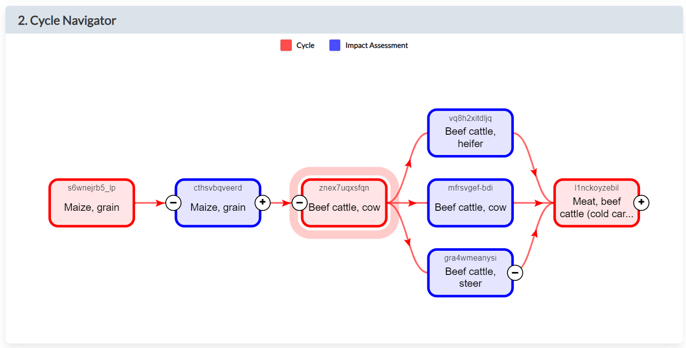

# Mapping the data format

## Cycles and Transformations

The [``Cycle``](https://www.hestia.earth/schema/Cycle) object in
[Hestia](https://www.hestia.earth) is the equivalent of a Brightway activity,
taking "inputs" and outputting "products".
The [``Transformation``](https://www.hestia.earth/schema/Transformation)
object is also equivalent to a Brightway activity.
However, contrary to cycles, transformations in Hestia do not live on their
own but are contained within a cycle in its "transformations" entry.

```python
import bw_hestia_bridge as bhb

cycle = bhb.get_hestia_node("znex7uqxsfqn")

# get the cycle inputs and outputs
print(cycle["inputs"])
print(cycle["outputs"])

# get a transformation associated to the cycle
transform = node["transformations"][0]
print(transform["term"])  # this is the Hestia Node associated to the transformation
```

The inputs and products of the transformation can only be accessed from within
the cycle, not from the transformation alone:

```python
tnode = bhb.get_hestia_node(transform["@id"])
print(tnode)  # no inputs or products

# get the inputs and products from the `transform` entry in the cycle
print(transform["inputs"])
print(transform["products"])
```

The supply chain of a cycle is therefore composed of other cycles and
transformations that are connected via their inputs and outputs, which are
[``Term``](https://www.hestia.earth/schema/Term) objects in Hestia, that
will become XXX in Brightway.

### Pitfalls and limitations

Unfortunately, not all inputs or outputs are associated to a generating or
managing process (there are "orphan" inputs and outputs).
To deal with this, we create a "mock" process associated to each of these
to convert the data into a Brightway database.

Also note that, contrary to Brightway activities, Hestia cycles have multiple products.
Furthermore, several products from a single cycles can enter as inputs into
another transformation or cycle, together with a same input from another
process, which means that there is currently no guarantee regarding how to
get the input/output ratios right.


## Connected cycles in the hestia database

To our knowledge `cycles` in hestia are not directly linked which means
that the API entry point at `/cycles/CYCLE_ID/cycles` always returns an empty
result. If you know otherwise, please tell us.

The following image is taken from
https://www-staging.hestia.earth/cycle/znex7uqxsfqn
:



As can be seen, `cycles` (in red) are connected indirectly via `impactassessments` (in blue).
A `cycle` may have multiple `products`. An `impactassessment` always has one `product`.

Therefore two `cycles` can be connected via multiple `impactassessments` (where each 
`impactassessment` refers to exactly one output product).

In the example above, the existing `cycle znex7uqxsfqn` which produces multiple input products of the
`cycle l1nckoyzebil` can be found via the connected `impactassessments` of
`cycle l1nckoyzebil`:

```python
import bw_hestia_bridge as bhb
bhb.get_hestia_node("l1nckoyzebil")
```

```python
{'@id': 'l1nckoyzebil',
 '@type': 'Cycle',
 'description': 'Meat, beef (carcass-weight) - Scenario 3',
 'inputs':
  [{'term': {'@type': 'Term',
   'termType': 'liveAnimal',
   'name': 'Beef cattle, cow',
   'units': 'number',
   '@id': 'beefCattleCow'},
  'value': [0.10645683869474658],
  'impactAssessment': {'@id': 'mfrsvgef-bdi', '@type': 'ImpactAssessment'},
  'impactAssessmentIsProxy': False,
  '@type': 'Input'},
 {'term': {'@type': 'Term',
   'termType': 'liveAnimal',
   'name': 'Beef cattle, heifer',
   'units': 'number',
   '@id': 'beefCattleHeifer'},
  'impactAssessment': {'@id': 'vq8h2xitdljq', '@type': 'ImpactAssessment'},
  'impactAssessmentIsProxy': False,
  '@type': 'Input'},
 {'term': {'@type': 'Term',
   'termType': 'liveAnimal',
   'name': 'Beef cattle, steer',
   'units': 'number',
   '@id': 'beefCattleSteer'},
  'impactAssessment': {'@id': 'gra4wmeanysi', '@type': 'ImpactAssessment'},
  'impactAssessmentIsProxy': False,
  '@type': 'Input'}
 ], ...
}

```

```python
bhb.get_hestia_node("mfrsvgef-bdi")
```

```python
{'@id': 'mfrsvgef-bdi',
 '@type': 'ImpactAssessment',
 'cycle': {'@id': 'znex7uqxsfqn', '@type': 'Cycle'},
 'product': {'term': {'@type': 'Term',
   'termType': 'liveAnimal',
   'name': 'Beef cattle, cow',
   'units': 'number',
   '@id': 'beefCattleCow'},
  '@type': 'Product'}, ...
}
```

Note that this accounts as well for `impactassessments` `vq8h2xitdljq` and `gra4wmeanysi`.


## Basic process data

Brightway will pull the follow attributes verbatim:

```python
{
    "@id": str,
    "description": str,  # But we label as comment
}
```

The following attributes will be put in a new `extra_metadata` dictionary:

```python
{
    "extra_metadata": {
        "createdAt": str,
        "updatedAt": str,
        "endDate": str,
        "cycleDuration": int,
        "functionalUnit": str,
        "defaultMethodClassification": str,
        "defaultMethodClassificationDescription": str,
    }
}
```

## `site`

Here we need to look up more information. So when we get:

```python
  "site": {
    "@type": "Site",
    "@id": "k-dc9b3ii8uw"
  },
```

We can query `https://api-staging.hestia.earth/sites/k-dc9b3ii8uw` and get:

```python
{
    '@context': 'https://www-staging.hestia.earth/schema/Site.jsonld',
    'createdAt': '2023-09-14',
    'updatedAt': '2023-09-15',
    '@id': 'k-dc9b3ii8uw',
    '@type': 'Site',
    'defaultSource': {
        '@id': 'ejhl-3wf1lvh',
        '@type': 'Source'
    },
    'siteType': 'cropland',
    'country': {
        '@type': 'Term',
        'termType': 'region',
        'name': 'Colombia',
        '@id': 'GADM-COL'
    },
    'name': 'Cropland - Colombia',
    'schemaVersion': '23.1.0',
    'originalId': 'colombia'
}
 ```

 We only need to take the `name`, so would add `"location": "Colombia"`

## `practices`

We take only the valued practices (i.e. those with a `value` attribute, and label these as `properties`. This is consistent with the way we import properties from the ecospold2 format.

We re-label a lot here to make the data feel more like Brightway inventory datasets:

```python
for practice in cycle['practices']:
    if 'value' not in practice:
        continue
    prperty = {
        'name': practice['term']['name'],
        'term_type': practice['term']['termType'],
        'term_id': practice['term']['@id'],
        'unit': practice['term'].get("units"),
        'amount': practice['value'][0],
    }
    if 'model' in practice:
        prperty['model'] = practice['model']
```

We then add a list of `prperty` instances as `"properties"`.

## `animals`

If the `animals` attribute is present in a cycle, we take it without modification, but do not use any of its data during the import.

## `inputs`

Each element in the `inputs` array maps to a technosphere input exchange. We won't import all the Hestia data.

We take only the valued practices (i.e. those with a `value` attribute. If there is not numeric value, we have nothing to insert into the matrix.

```python
from collections import defaultdict

MAPPED_OPTIONAL_FIELDS = {
    'description': 'comment',
    'sd': 'standard deviation',
    'min': 'minimum',
    'max': 'maximum',
    'statsDescription': 'statistics',
}
OPTIONAL_FIELDS = {
    'startDate',
    'endDate',
    'methodClassification',
    'observations',
    'methodClassificationDescription',
    'model',
    'modelDescription',
}
SUFFIXES = {'', 'Sd', 'Min', 'Max', 'StatsDefinition'}
PRICE = {'price' + suffix for suffix in SUFFIXES}
COST = {'cost' + suffix for suffix in SUFFIXES}
DISTANCE = {'distance' + suffix for suffix in SUFFIXES}

counter = defaultdict(int)

for inpt in cycle['inputs']:
    if 'value' not in inpt:
        continue

    group = "{}-{}".format(
        inpt['term']['name'],
        counter[inpt['term']['name']]
    )
    counter[inpt['term']['name']] += 1

    exchange = {
        'name': inpt['term']['name'],
        'term_type': inpt['term']['termType'],
        'term_id': inpt['term']['@id'],
        'unit': inpt['term'].get("units"),
        'amount': inpt['value'][0],
        'group': group,
    }
    for field in OPTIONAL_FIELDS:
        if field in inpt:
            exchange[field] = inpt[field]
    for orig, new in MAPPED_OPTIONAL_FIELDS.items():
        if orig in inpt:
            exchange[new] = inpt[orig]
    if 'price' in inpt:
        exchange['price'] = {key: inpt[key] for key in PRICE if key in inpt}
        if 'currency' in inpt:
            exchange['price']['currency'] = inpt['currency']
    if 'cost' in inpt:
        exchange['cost'] = {key: inpt[key] for key in COST if key in inpt}
        exchange['cost']['currency'] = inpt['currency']
```

### `transport` in `inputs`

Hestia includes an optional list of transport inputs attached to another input, but we need a flat list of technosphere input exchanges. We therefore unroll the optional `transport` attribute.

Hestia includes emissions and inputs (e.g. diesel) to transport, but the intent of this importer is to link these to the original background data sources, so we do not include the Hestia fuel consumption or direct emissions.

We will store the connection between transport inputs and their parent inputs using the `group` field.

Transport `value` fields are always in ton-kilometers, but are somehow optional. We skip those for which we don't have a `value` field, as we can't use them in inventory modelling.

```python
DISTANCE = {'distance' + suffix for suffix in SUFFIXES}

for inpt in cycle['inputs']:
    ...

    if 'transport' in inpt:
        for transport in inpt['transport']:
            if 'value' not in transport:
                continue
            exchange = {
                'name': transport['term']['name'],
                'term_type': transport['term']['termType'],
                'term_id': transport['term']['@id'],
                'unit': transport['term'].get("units"),
                'amount': transport['value'],
                'returnLegIncluded': transport['returnLegIncluded'],
                'group': group,
            }
            for field in OPTIONAL_FIELDS:
                if field in transport:
                    exchange[field] = transport[field]
            for orig, new in MAPPED_OPTIONAL_FIELDS.items():
                if orig in transport:
                    exchange[new] = transport[orig]
            if 'distance' in transport:
                exchange['distance'] = {key: transport[key] for key in DISTANCE if key in transport}
```

We also take the `practices` as properties, as above.

## `products`

We will construct a supply chain of `process` nodes, which will produce `products`, and consume `products` (if coming from other Hestia cycles) or `processes` (if coming from a background database). For each `product`, we therefore need to create a new inventory dataset with the type `product`. But we also need to add a production exchange to the cycle unit process.

```python
```

